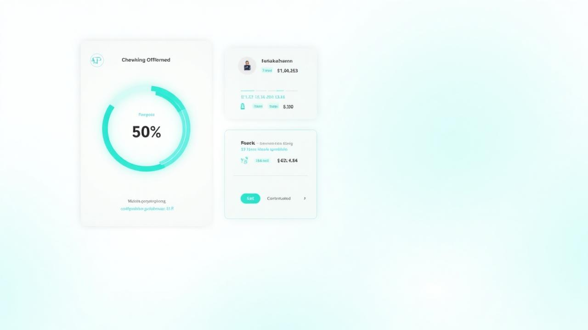
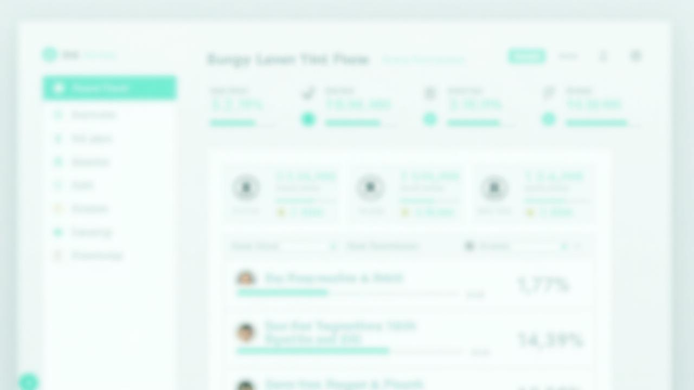

# FinalCommit.Fund 💰

<div align="center">



**A private contribution tracking system for IT students**

[](https://lovable.dev)
[](https://reactjs.org/)
[](https://www.typescriptlang.org/)
[](https://tailwindcss.com/)

[Live Demo](https://final-commit-fund.lovable.app) · [Report Bug](#) · [Request Feature](#)

</div>

---

## 📖 Overview

FinalCommit Fund is a professional internal tool designed for 10 IT students to track and manage group contributions towards a shared goal. The system features a minimalist, modern aesthetic with teal accents, real-time updates, and role-based access control.

### Key Features

- 🎯 **Individual Contribution Tracking** - Each member targets KES 700
- 📊 **Real-time Progress Updates** - Live group statistics with Supabase Realtime
- 🔐 **Secure Authentication** - Email-based signup with verification
- 👑 **Treasurer Dashboard** - Special admin view for group management
- 📱 **Mobile Responsive** - Optimized for all device sizes
- ⏰ **Deadline Countdown** - May 1st, 2026 deadline with visual timer

---

## 🖼️ Screenshots

### Dashboard View


*Personal contribution dashboard showing progress, payment history, and remaining balance*

---

## 🏗️ Architecture

```
┌─────────────────────────────────────────────────────────────┐
│                        Frontend                              │
│  React + TypeScript + Tailwind CSS + shadcn/ui              │
├─────────────────────────────────────────────────────────────┤
│                     State Management                         │
│  TanStack Query (React Query) + React Context               │
├─────────────────────────────────────────────────────────────┤
│                        Backend                               │
│  Lovable Cloud (Supabase)                                   │
│  ├── PostgreSQL Database                                    │
│  ├── Row Level Security (RLS)                               │
│  ├── Edge Functions (M-Pesa, Reminders)                     │
│  └── Realtime Subscriptions                                 │
└─────────────────────────────────────────────────────────────┘
```

---

## 🛠️ Tech Stack

| Category | Technology |
|----------|------------|
| **Frontend** | React 18, TypeScript, Vite |
| **Styling** | Tailwind CSS, shadcn/ui |
| **State Management** | TanStack React Query |
| **Routing** | React Router v6 |
| **Backend** | Lovable Cloud (Supabase) |
| **Database** | PostgreSQL |
| **Authentication** | Supabase Auth |
| **Edge Functions** | Deno (M-Pesa integration) |
| **Deployment** | Lovable Platform |

---

## 📁 Project Structure

```
├── public/
│   ├── docs/                 # Documentation images
│   └── favicon.ico
├── src/
│   ├── components/
│   │   ├── auth/             # Authentication components
│   │   │   ├── GoogleButton.tsx
│   │   │   ├── PasswordStrengthIndicator.tsx
│   │   │   └── ProtectedRoute.tsx
│   │   ├── layout/           # Layout components
│   │   │   ├── Header.tsx
│   │   │   └── Layout.tsx
│   │   ├── profile/          # Profile management
│   │   │   └── ProfileCompletionModal.tsx
│   │   ├── treasurer/        # Treasurer-only components
│   │   │   └── ReminderManager.tsx
│   │   └── ui/               # shadcn/ui components
│   ├── hooks/
│   │   ├── useAuth.tsx       # Authentication context
│   │   ├── useContributions.tsx  # Contribution data hooks
│   │   └── use-toast.ts      # Toast notifications
│   ├── lib/
│   │   ├── constants.ts      # App configuration
│   │   ├── utils.ts          # Utility functions
│   │   └── validations.ts    # Form validations
│   ├── pages/
│   │   ├── Index.tsx         # Landing page
│   │   ├── Dashboard.tsx     # Member dashboard
│   │   ├── Contribute.tsx    # Payment page
│   │   ├── GroupProgress.tsx # Group statistics
│   │   ├── Treasurer.tsx     # Admin dashboard
│   │   ├── Login.tsx
│   │   ├── Signup.tsx
│   │   └── ProfileSettings.tsx
│   └── integrations/
│       └── supabase/         # Supabase client & types
├── supabase/
│   ├── functions/            # Edge functions
│   │   ├── mpesa-stk-push/   # M-Pesa payment initiation
│   │   ├── mpesa-webhook/    # M-Pesa callbacks
│   │   ├── send-reminders/   # Email reminders
│   │   └── delete-account/   # Account deletion
│   └── config.toml           # Supabase configuration
└── README.md
```

---

## 🗄️ Database Schema

### Tables

#### `profiles`
| Column | Type | Description |
|--------|------|-------------|
| `id` | UUID | Primary key |
| `user_id` | UUID | Supabase auth reference |
| `name` | TEXT | Member's full name |
| `email` | TEXT | Email address |
| `phone` | TEXT | Phone number (M-Pesa) |
| `username` | TEXT | Optional username |
| `is_treasurer` | BOOLEAN | Admin flag |
| `onboarding_completed` | BOOLEAN | Profile completion status |

#### `contributions`
| Column | Type | Description |
|--------|------|-------------|
| `id` | UUID | Primary key |
| `user_id` | UUID | Member reference |
| `amount` | INTEGER | Amount in KES |
| `status` | TEXT | completed/pending |
| `api_ref` | TEXT | M-Pesa reference |
| `created_at` | TIMESTAMP | Payment date |

#### Views

- `public_profiles` - Public-facing profile data (excludes sensitive info)

---

## 🔐 Security

### Row Level Security (RLS)

- **Profiles**: Users can only read/update their own profile
- **Contributions**: Users can view their own; Treasurer can view all
- **Public Views**: Non-sensitive aggregate data accessible to all authenticated users

### Authentication Flow

1. User signs up with email/password
2. Email verification link sent (Supabase Auth)
3. On first login, profile completion modal appears
4. User enters name and phone number
5. Full access granted to dashboard

---

## ⚙️ Configuration

### Environment Variables

The following are automatically configured by Lovable Cloud:

```env
VITE_SUPABASE_URL=<your-project-url>
VITE_SUPABASE_PUBLISHABLE_KEY=<your-anon-key>
VITE_SUPABASE_PROJECT_ID=<your-project-id>
```

### Fund Constants

Located in `src/lib/constants.ts`:

```typescript
export const TARGET_AMOUNT = 700;      // KES per member
export const DEADLINE = new Date('2026-05-01');
export const TOTAL_MEMBERS = 10;
export const TOTAL_TARGET = TARGET_AMOUNT * TOTAL_MEMBERS; // KES 7,000
```

---

## 👥 Member Roles

### Regular Member
- View personal dashboard and contribution history
- Make contributions via M-Pesa
- View group progress (aggregate only)
- Update profile settings

### Treasurer
- All member permissions
- View detailed member list with individual amounts
- Send payment reminders
- Access to treasurer dashboard
- Manage group settings

---

## 🚀 Getting Started

### Prerequisites

- Node.js 18+
- A Lovable account (for cloud features)

### Local Development

1. Clone the repository
2. Install dependencies:
   ```bash
   npm install
   ```
3. Start the development server:
   ```bash
   npm run dev
   ```
4. Open [http://localhost:5173](http://localhost:5173)

### Deployment

The app is automatically deployed via Lovable's platform:

- **Preview**: https://id-preview--42585022-ee83-474c-a79b-6cab386ea1b3.lovable.app
- **Production**: https://final-commit-fund.lovable.app

---

## 📱 Features in Detail

### Real-time Updates

The app uses Supabase Realtime to push contribution updates to all connected clients:

```typescript
const channel = supabase
  .channel('public-contributions-updates')
  .on('postgres_changes', {
    event: '*',
    schema: 'public',
    table: 'contributions',
  }, (payload) => {
    // Update UI immediately
  })
  .subscribe();
```

### M-Pesa Integration

Edge functions handle M-Pesa STK Push payments:

1. User enters phone number and amount
2. `mpesa-stk-push` function initiates payment
3. User receives STK push on phone
4. `mpesa-webhook` receives confirmation
5. Contribution recorded in database

### Member Status Tracking

Members are categorized by contribution progress:

| Status | Criteria | Badge Color |
|--------|----------|-------------|
| **Completed** | ≥ KES 700 | Green |
| **In Progress** | KES 1-699 | Yellow |
| **Pending** | KES 0 | Gray |

---

## 🎨 Design System

### Color Palette

| Token | Usage |
|-------|-------|
| `--primary` | Teal accent (buttons, links) |
| `--success` | Green (completed states) |
| `--warning` | Yellow (in-progress states) |
| `--destructive` | Red (errors, urgent) |
| `--muted` | Gray (secondary text) |

### Typography

- **Headings**: Inter, bold weights
- **Body**: Inter, regular/medium
- **Monospace**: Numbers and currency displays

---

## 🤝 Contributing

### Getting Started as a New Developer

1. **Clone the repository**
   ```bash
   git clone <repository-url>
   cd finalcommit-fund
   ```

2. **Install dependencies**
   ```bash
   npm install
   ```

3. **Start development server**
   ```bash
   npm run dev
   ```

4. **Run tests**
   ```bash
   npm run test
   ```

### Development Workflow

1. Create a feature branch from `main`
   ```bash
   git checkout -b feature/your-feature-name
   ```

2. Make your changes following the coding standards below

3. Write/update tests for your changes

4. Commit with descriptive messages
   ```bash
   git commit -m "feat: add new contribution reminder feature"
   ```

5. Push and create a Pull Request

### Coding Standards

#### TypeScript
- Use strict typing; avoid `any`
- Define interfaces for all data structures
- Use meaningful variable/function names

#### React Components
- Use functional components with hooks
- Keep components small and focused
- Extract reusable logic into custom hooks

#### Styling
- Use Tailwind CSS utility classes
- Use semantic tokens from the design system (never hardcode colors)
- Follow mobile-first responsive design

#### File Organization
```
src/components/feature/
├── FeatureName.tsx       # Main component
├── FeatureName.test.tsx  # Tests
├── useFeatureName.ts     # Custom hook (if needed)
└── index.ts              # Barrel export
```

### Commit Message Convention

Follow [Conventional Commits](https://www.conventionalcommits.org/):

| Type | Description |
|------|-------------|
| `feat` | New feature |
| `fix` | Bug fix |
| `docs` | Documentation changes |
| `style` | Formatting (no code change) |
| `refactor` | Code restructuring |
| `test` | Adding/updating tests |
| `chore` | Maintenance tasks |

### Testing Guidelines

- Write tests for all new features
- Maintain >80% coverage for critical paths
- Test file naming: `ComponentName.test.tsx`

```typescript
import { describe, it, expect } from "vitest";
import { render, screen } from "@testing-library/react";

describe("ComponentName", () => {
  it("renders correctly", () => {
    render(<ComponentName />);
    expect(screen.getByText("Expected")).toBeInTheDocument();
  });
});
```

### Pull Request Checklist

- [ ] Code follows project style guidelines
- [ ] Tests pass locally
- [ ] New features have tests
- [ ] Documentation updated if needed
- [ ] No console errors or warnings
- [ ] Responsive design verified

---

## 📞 Support

For issues or questions, contact the Treasurer or create an issue in this repository.

---

## 📜 License

This is a private project for FinalCommit Fund members.

---

<div align="center">

**Made with ❤️ by FinalCommit Fund Team**

*Built on [Lovable](https://lovable.dev)*

</div>
